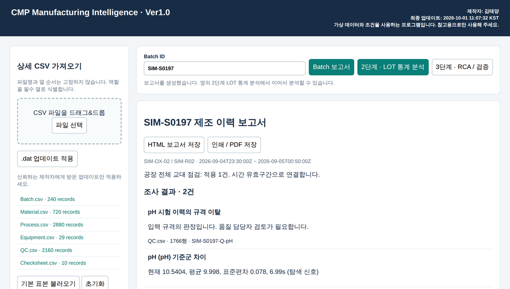
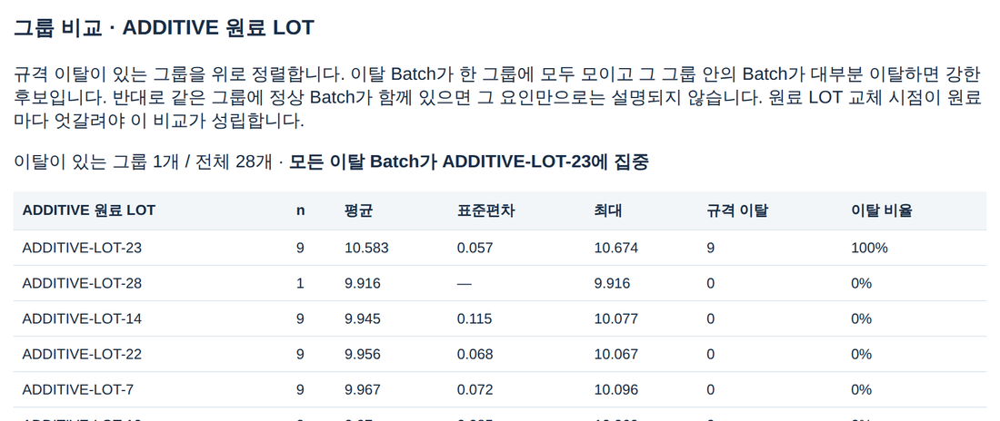
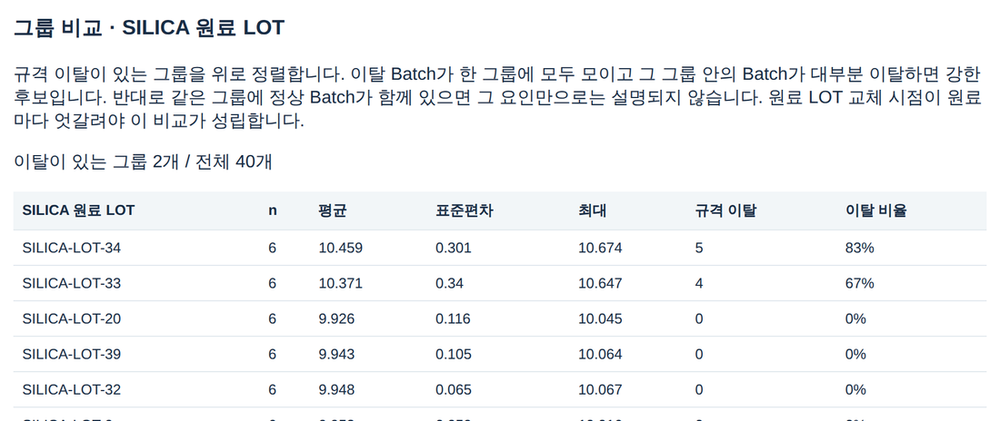
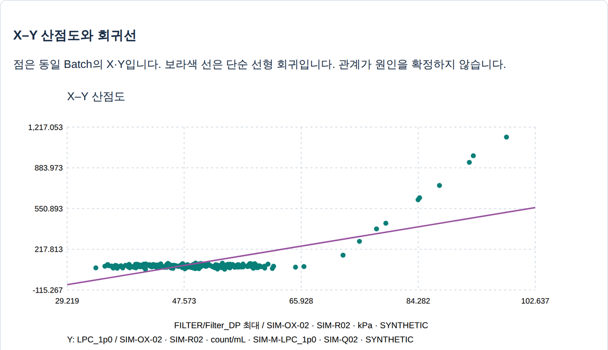

# CMP Manufacturing Intelligence

[](https://thisissun93.github.io/CMP-Manufacturing-Intelligence/)

CMP 슬러리 Batch의 제조 이력(원료 LOT·공정·설비·QC)을 한 화면에 연결하고, 규격 이탈의 원인 후보를 **데이터로 좁혀 가는 과정**을 보여주는 오프라인 조사 도구입니다. 설치 없이 브라우저에서 실행됩니다.

제작: 김태양 · FC-BGA 기판 공정/품질 엔지니어 6년 (설비 셋업, JMP 기반 DOE/SPC, 소재 Qualification, 수율 개선)

> **English summary** — An offline, browser-based investigation tool for CMP slurry batch records. It links raw-material lots, process data, equipment events and QC results, then helps narrow down root-cause candidates for out-of-spec batches with lot-group comparison, capability indices, control charts and X–Y regression, and drafts an RCA review. The demo runs on 240 synthetic batches containing two planted quality events (an additive-lot pH excursion and a filter-loading LPC excursion), and the tool separates both causes from confounding factors.

---

## 케이스 스터디 · 240 Batch 중 15건 HOLD, 원인은 두 가지

시연 데이터에는 실제 현장에서 자주 만나는 두 종류의 이탈이 섞여 있습니다. 프로그램에서 **‘통계용 240 Batch 불러오기’**를 누르면 같은 과정을 그대로 재현할 수 있습니다.

### 사건 A · pH 상한 이탈 9건 → 첨가제 LOT 하나로 좁혀짐

**1. 이탈 Batch 확인.** SIM-S0197 보고서에서 pH 10.54(USL 10.5)가 확인됩니다. 과거 정상 기준군(n=180) 대비 +7σ로, 측정 산포로는 설명되지 않는 수준입니다.



**2. 원료별로 같은 질문을 던짐.** 그룹 요인을 ADDITIVE로 두면 이탈 9건이 **ADDITIVE-LOT-23 하나에 100% 집중**됩니다. 그 LOT의 9 Batch는 모두 이탈했고, 다른 27개 LOT에서는 이탈이 0건입니다.



**3. 교란 요인 배제.** 같은 기간에 쓰인 SILICA-LOT-33·34에도 이탈이 있습니다. 하지만 두 LOT 모두 정상 Batch가 섞여 있어(83%, 67%) 실리카만으로는 설명되지 않습니다. DIW-LOT-14도 15 Batch 중 6건이 정상입니다. 원료마다 LOT 교체 시점이 엇갈리기 때문에 이 비교가 성립합니다(실리카 6 · 첨가제 9 · DIW 15 Batch 주기). 혼합 온도와 교반 속도는 해당 기간에 정상 범위였습니다.



**결론과 조치안.** 원인 후보는 ADDITIVE-LOT-23의 알칼리 함량 편차입니다. 다음 순서로 확인합니다: 해당 LOT CoA·입고검사 기록 재검토 → 보관 샘플로 첨가제 단독 pH·적정 재시험 → 공급사 SCAR 발행 → 입고검사에 알칼리도 항목 추가 검토.

### 사건 B · LPC(≥1.0 µm) 상한 이탈 6건 → MIX-2 필터 교체 지연

**1. 패턴.** 이탈 6건(SIM-S0215~S0230)이 모두 MIX-2에서만 발생했고, 원료 LOT과는 무관했습니다.

**2. 공정 변수와 연결.** X를 필터 차압(Filter_DP) 최대값, Y를 LPC_1p0로 두면 70 kPa 부근부터 LPC가 급격히 올라갑니다. MIX-2는 정기 필터 교체(8 Batch 주기)가 한 번 누락되어 21 Batch를 연속 사용했고, 차압이 84~98 kPa(경보 80 kPa)까지 올라갔습니다. 다른 설비의 차압은 최대 62 kPa였습니다.



**3. 조기 신호.** 규격 이탈 전에도 신호가 있었습니다. SIM-S0206(차압 75 kPa)의 LPC는 282 count/mL로, 규격(600) 안이지만 평소 중앙값 81의 3.5배였습니다. FILTER_CHANGE 이후(SIM-S0233부터)는 차압 37 kPa, LPC 75로 정상 복귀했습니다.

**결론과 조치안.** 필터 교체를 Batch 수 기준에서 **차압 기준(예: 70 kPa 도달 시 교체)으로 전환**합니다. 차압 경보 시 출하 전 LPC 추가 검사를 OCAP에 반영합니다. 이 내용은 프로그램의 3단계 RCA/검증 화면에서 FMEA·Control Plan 초안으로 정리할 수 있습니다.

---

## 무엇을 할 수 있나

| 단계 | 기능 |
|---|---|
| 1 · Batch 보고서 | Batch·Material·Process·Equipment·QC·Checksheet 6개 CSV를 Batch 기준으로 연결. QC 규격 이탈, 과거 정상 기준군 대비 편차, 공정 상한 초과, 교대 점검 누락 탐지 |
| 2 · LOT 통계 분석 | Cp/Cpk·Pp/Ppk, I-MR 관리도, 분포·추세, X–Y 회귀(Pearson/Spearman/R²), **설비 또는 원료 LOT별 그룹 비교**, %Contribution(ANOVA 기반) |
| 3 · RCA / 검증 | 문헌 기반 원인 후보, OCAP/FMEA/Control Plan 초안, 편집 가능한 검토 문서, 검토 이력 백업·복원 |

데이터 무결성 원칙: QC는 승인된 최종 결과가 정확히 하나일 때만 사용합니다. 재시험 통과가 최초 이탈 기록을 지우지 않습니다. 결측은 0으로 채우지 않습니다. 자세한 내용은 [DATA_POLICY.md](DATA_POLICY.md)를 참고하세요.

## 실행 방법

- **바로 실행:** 위 배지 링크(GitHub Pages)를 엽니다.
- **오프라인 실행:** `app/CMP_Batch_Investigator_v2.html`을 Edge 또는 Chrome에서 엽니다.

‘통계용 240 Batch 불러오기’ → Batch ID 입력 → **Batch 보고서** → **2단계 LOT 통계 분석** → **3단계 RCA/검증** 순서로 진행합니다. `samples/`의 CSV 6개를 직접 끌어다 놓아도 됩니다.

## 개발

Node.js 22 이상, 외부 패키지는 필요 없습니다.

```
npm run generate   # 시연 데이터 재생성 (고정 시드, 결정적)
npm run build      # 단일 HTML 빌드
npm test           # 계산·데이터·시나리오 회귀 시험
```

`work/`에 계산·UI·빌드 소스가 있고, `work/generate-sample240.cjs`가 시연 데이터를 만듭니다. 시험은 두 사건이 설계대로 분리되는지(pH 이탈 ↔ ADDITIVE-LOT-23, LPC 이탈 ↔ MIX-2 필터 차압)와 데이터가 생성기 결과와 일치하는지를 확인합니다. 빌드 결과는 `outputs/CMP_Batch_Investigator_v2_Update/`에 생성되고, 배포용 사본은 `app/`입니다.

## 한계

- 모든 데이터는 **합성 데이터**이며, 규격 수치는 시연용 가정입니다. 실제 공장 데이터로 검증된 시스템이 아닙니다.
- 그룹 비교·상관·R²는 원인 후보를 좁히는 도구이며 원인 확정이 아닙니다. 확정에는 재시험·CoA·현장 확인이 필요합니다.
- 측정시스템(MSA)·정규성·안정성은 자동 검증되지 않습니다.
- 브라우저 저장은 인증된 감사 추적이 아니며, MES 연동·전자서명·사용자 권한은 없습니다.
- 다음 개선: JMP 등 독립 통계 도구와 계산 교차검증, 브라우저 자동 회귀 시험(CI), 다요인 분석.

검증 범위는 [VALIDATION.md](VALIDATION.md), 보안 유의사항은 [SECURITY.md](SECURITY.md)에 있습니다.

## 이용 조건

오픈소스 라이선스는 아직 정하지 않았습니다. 포트폴리오 열람과 시연 목적의 이용을 환영합니다.
